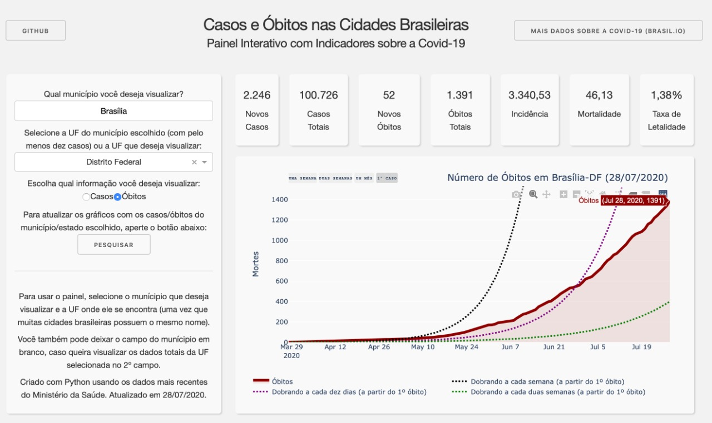
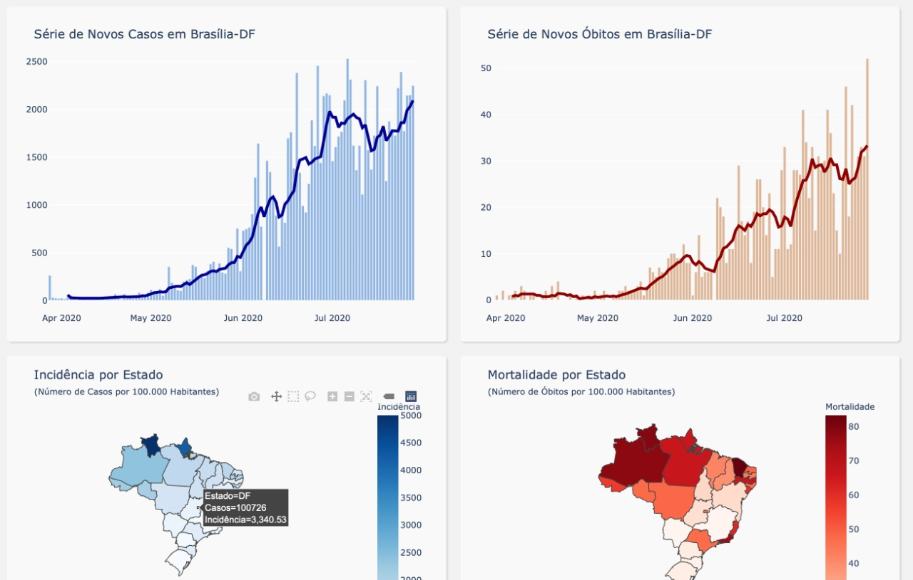
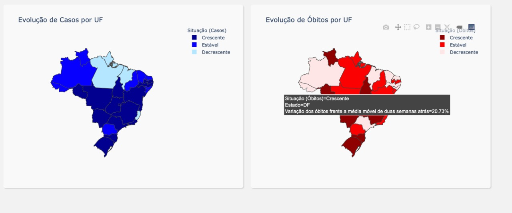

# Dados da Covid-19 em todo o Brasil

## Sobre o aplicativo e o autor
Esse dashboard foi construído usando o *Dash*, um framework interativo desenvolvido pelo [*Plotly*](https://plot.ly/). 

Os dados utilizados são os do [Ministério da Saúde](https://covid.saude.gov.br), coletados a partir das Secretarias Estaduais de Saúde.

Redes sociais do autor (Vinícius de Almeida Nery Ferreira): [Twitter](https://twitter.com/_vini_nery_) e [LinkedIn](https://www.linkedin.com/in/viniciusdealmeidaneryferreira/).

A grande inspiração para o design foi [este projeto](https://dash-gallery.plotly.host/dash-oil-and-gas/), cuja documentação está disponível [aqui](https://github.com/plotly/dash-sample-apps/tree/master/apps/dash-oil-and-gas).

## Acesso online

O painel pode ser visualizado na URL http://dadoscovid19.herokuapp.com

## Prints do dashboard

